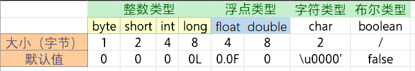

# Java基础

## 概述

### Java语言特点

1. 完全面向对象

2. 平台无关

   > 关键是JVM（Java虚拟机）
   >
   > Java源代码经编译器编译后生成的字节码文件，可以在不同平台下的JVM虚拟机上被翻译成相应的机器码执行

3. 支持多线程

   > C++ 语言没有内置的多线程机制，因此必须调用操作系 统的多线程功能来进行多线程程序设计，而 Java 语言却提供了多线程 支持

4. 支持网络编程并且很方便

5. 编译与解释并行

### JDK、JRE和JVM

JDK是：Java开发工具包

JRE是：Java运行时环境

JVM是：Java虚拟机

它们三个是包含关系，自底向上，

JVM+类库+部署+用户接口工具包=JRE

JRE+Java语言+工具&工具API（例如javac编译程序、javadoc文档等）=JDK


## 语言细节

### 类

1. 一个Java文件里可以有多个类吗？

   可以，但是最多**只能有一个被public装饰的类**，而且这个类**类名必须与文件名保持一致**

#### 内部类

四种

1. 成员内部类
2. 静态内部类
3. 局部（方法）内部类
4. 匿名内部类

### Java访问权限

三种访问符：private、protected、public，不加任何修饰符则为default

修饰**成员变量/方法**，四种访问权限含义如下：

* private：该成员可以被**该类内部成员**访问
* default：该成员可以被该类内部成员访问，也可以被**同一包下的其他类**访问
* ==protected：……还可以被**它的子类**访问==
* public：该成员可以被**任意包下，任意类的成员**访问

修饰**类**时，两种访问权限：

* default：该类可以被同一包下的其他类访问
* public：该类可以被任意包下，任意类访问

### Java数据类型

   包括**基本数据类型**和**引用数据类型**

#### 基本数据类型

基本数据类型8个，4小类：

1. 整数类型（byte/short/int/long）
2. 浮点类型（float/double）
3. 字符类型（char）
4. 布尔类型（boolean）



   > 除布尔类型之外的其他7个类型，都可看做数字类型，并进行类型转换

#### 引用数据类型

分三类：数组、类、接口

**默认值均为null**

   > 引用类型本质上就是通过指针，指向堆中对象所持有的内存空间

5. int类型数据范围是多少？

   int类型占4字节（32位）范围是：-2^31^~2^31^-1

### 成员变量与局部变量

5. 全局变量和局部变量的区别？

   成员变量：

   1. 成员变量是在**类的范围里**定义的变量
   
   2. 成员变量有默认初始值
   
#### 类变量与实例变量

   3. 未被`static`修饰的成员变量也叫**实例变量**，

      * 它存储于对象所在的的**堆**内存中，生命周期与对象相同

      * 实例变量只能由对象调用

   4. 被`static`修饰的成员变量也叫**类变量**，

      * 它存储于**方法区**中，生命周期与当前类相同

      * 类变量可以被对象调用，也可以由类名直接调用

   > Java中其实没有真正的全局变量

   局部变量：

   1. 局部变量是在方法里定义的变量
   2. 局部变量没有默认初始值
   3. 局部变量存储于**栈**内存中，作用的范围结束，变量空间会自动释放

### 包装类

1. 为什么要有包装类？

   Java是面向对象的语言，其设计理念是“一切皆对象”。但8中基本数据类型却出现了意外，它们不具备对象的特性。正是为解决这一问题，Java为每个基本数据类型都定义了一个对应的引用类型，就是包装类

2. 说一说自动装箱、自动拆箱的应用场景

   JDK1.5提供的功能

   通过…可以大大**简化基本类型变量和包装类对象之间的转换过程**

> 自动装箱：可以把一个基本数据类型直接赋值给对应的包装类型
>
> 自动拆箱：可以把一个包装类型的对象直接赋值给对应的基本类型

3. ***int和Integer有什么区别，二者在做==运算时会得到什么结果？***

   int是基本数据类型，Integer是int的包装类。二者在做`==`运算时，==Integer会自动拆箱为int类型==

   届时，如果两个int值相等则返回true，否则就返回false

4. 如何对Integer和Double类型判断相等？

   Integer和Double不能直接比较

   整数、浮点类型的包装类，都继承于Number类型，而Number类型分别定义了将数字转换为byte、short、int、long、float、double的方法。

   所以，可以将Integer、Double**先转换为相同的基本数据类型**（如double），然后使用==进行比较。

> 包括：
>
> * 不能用`==`直接进行比较
> * 不能转为字符串进行比较，因为转字符串后，浮点值带小数点，整数值不带
> * 不能使用`compareTo`方法进行比较（该方法只能对相同类型进行比较）

### Object类

是Java中所有类型的父类

7. ***介绍一下Object类中的方法***

    Object类提供了如下几个常用方法：

    * `Class<?> getClass()`：返回该对象的运行时类

    * `boolean equals(Object obj)`：判断指定对象与当前对象是否相等

    * `int hashCode()`：返回该对象的hashCode值

      > Object类的hashCode()方法根据该对象的地址来计算。但很多类都重写了Object类的hashCode()方法，不再根据地址来计算其hashCode()方法值。

    * `String toString`：当程序使用`System.out.println()`方法输出一个对象，或者把某个对象和字符串进行连接运算时，系统都会自动调用该对象的此方法返回该对象的字符串表示

      Object类的toString()方法返回 运行时类名@十六进制hashCode值 格式的字符串

    另外，Object类还提供了`wait()`、`notify()`、`notifyAll()`方法，通过这几个方法可以控制线程的暂停和运行

    Object类还提供了一个clone()方法，该方法用于帮助其他对象来实现“自我克隆”，得到一个当前对象的副本，而且二者之间完全隔离。

    > 由于该方法使用了`protected`修饰，因此它只能被子类重写或者调用

    

8. 为什么要重写`hashCode()`和`equals()`

      Object类提供的equals()方法默认是用==来进行比较的，也就是说只有两个对象是同一个对象时，才能返回相等的结果。而实际的业务中，我们通常的需求是，若两个不同的对象它们的内容是相同的，就认为它们相等。鉴于这种情况，Object类中equals()方法的默认实现是没有实用价值的，所以通常都要重写。


### ==和`equals()`区别

 ==运算符：

  - 作用于基本数据类型时，是比较两个数值是否相等；
  - 作用于引用数据类型时，是比较两个对象的内存地址是否相同，即判断它们是否为同一个对象；

 `equals()`方法：

  - 没有重写时，Object默认以 == 来实现，即比较两个对象的内存地址是否相同；

  - 进行重写后，一般会按照对象的内容来进行比较

    ```java
    String s1 = "hello";
    String s2 = new String("hello");
    System.out.println(s1==s2);
    // false,比较的是引用
    System.out.println(s1.equals(s2));
    // true,比较的是各个字符
    // 也就是说String重写了equals方法  
    ```

### `hashCode()`和`equals()`

`hashCode()`用于获取哈希码（散列码），`eauqls()`用于比较两个对象是否相等，它们应遵守如下规定：

- 如果两个对象相等，则它们必须有相同的哈希码
- 如果两个对象有相同的哈希码，则它们未必相等

> 由于`hashCode()`与`equals()`具有联动关系，所以当由于业务需要重写了`equals()`方法，通常也要将hashCode()进行重写，使得这两个方法始终满足相关的约定

### 重写和重载

重载发生在同一个类中，若多个方法之间**方法名相同，参数列表不同**，则它们构成重载关系。重载**与方法的返回值及访问修饰符无关**

重写发生在父类的子类中，若子类方法想要和父类方法构成重写关系，则：

* 子类方法名、参数列表必须与父类方法相同
* 返回值、抛出异常要小于等于父类方法
* 访问修饰符要大于等于父类方法（若父类方法是private，则子类不能对其进行重写）

7. ***构造方法能不能重写？***

   不能，因为重写要求子类方法和父类方法同名，而构造方法需要和类保持同名，但子类和父类是不同的类不可能同名，所以矛盾了。

## 接口

### 接口和抽象类

#### 相同点：

 * 都不能被实例化，只能被实现/继承
* 都可以包含抽象方法，实现接口或继承抽象类的普通子类都必须实现这些抽象方法

#### 不同点

##### 概念上

* 接口体现的是一种规范

     对于接口的实现者而言，接口规定了实现者必须向外提供哪些服务；对于接口的调用者而言，接口规定了调用者可以调用哪些服务，以及如何调用这些服务。

     > 当在一个程序中使用接口时，接口是多个模块间的耦合标准；当在多个应用程序之间使用接口时，接口是多个程序之间的通信标准

* 抽象类体现的是一种模板式设计

     抽象类作为多个子类的抽象父类，可以被当成系统实现过程中的中间产品，这个中间产品已经实现了系统的部分功能，但这个产品依然不能当成最终产品，必须有更进一步的完善，这种完善可能有几种不同方式。

##### 具体

   * 接口里只能包含抽象方法、静态方法、默认方法和私有方法，不能为普通方法提供方法实现

     抽象类可以包含普通方法

   * 接口里只能定义**静态常量**

     抽象类中还可以定义**普通成员变量**

   * 接口里**不包含构造器**；抽象类里可以包含构造器

     > 抽象类里的构造器并不是用于创建对象，而是让其子类调用这些构造器来完成属于抽象类的初始化操作

   * 一个类最多只能有一个直接父类，包括抽象类；但一个类可以直接实现多个接口，通过实现多个接口可以弥补Java单继承的不足

#### 面向接口编程

降低模块间耦合，提升系统地可拓展性和可维护性

## 泛型

Java集合有个缺点：把一个对象“丢进”集合里之后，集合就会“忘记”这个对象的数据类型，当再次取出该对象时，该对象的编译类型就变成了Object类型（其运行时类型没变）

之所以被设计成这样，是因为集合的设计者不知道我们会用集合来保存什么类型的对象，所以他们把集合设计成能保存任何类型的对象，只要求具有很好的通用性。但这样做带来如下两个问题：

- 集合对元素类型没有任何限制，这样可能引发一些问题。例如，想创建一个只能保存Dog对象的集合，但程序也可以轻易地将Cat对象“丢”进去，所以可能引发异常。
- 由于把对象“丢进”集合时，集合丢失了对象的状态信息，只知道它盛装的是Object，因此取出集合元素后通常还需要进行强制类型转换。这种强制类型转换既增加了编程的复杂度，也可能引发ClassCastException异常。

从Java 5开始，Java引入了“==参数化类型==”的概念，允许程序在创建集合时指定集合元素的类型，即为“泛型”

### 好处

编译时检查类型安全，且所有的强制转换都是自动和隐式的，以提高代码的重用率

### 泛型擦除

当把一个具有泛型信息的对象赋给另一个没有泛型信息的变量时，所有在尖括号之间的类型信息都将被扔掉

> 反过来没有问题，称为“泛型转换”

- ? 是类型通配符，List<?> 可以表示各种泛型List的父类，意思是元素类型未知的List；
- List<? super T> 用于设定类型通配符的下限，此处 ? 代表一个未知的类型，但它必须是T的父类型；
- List<? extends T> 用于设定类型通配符的上限，此处 ? 代表一个未知的类型，但它必须是T的子类型。

## 反射机制

#### 什么是反射?

反射就是 在程序运行期间,动态地获取对象的属性和方法的功能

获取Class对象有4种方法

1. Class.forName("类路径")
2. 类名.class
3. 对象名.`getClass()`
4. 基本类型的包装类，可以调用包装类的Type属性来获得该包装类的Class对象

优点：运行期间能够动态地获取类，提高代码的灵活性

缺点：性能比直接的Java代码差很多

> 要解析字节码，通过类加载器创建

应用场景：

* Spring的XML配置模式

* 动态代理

* JDBC

  ```java
  class.forName('com.mysql.jdbc.Driver.class')
  ```


### Lambda表达式

可以替代匿名内部类，本质是一个匿名函数


## 参考

* [30 张Java 的思维导图，全面梳理构建 Java 的知识体系](https://zhuanlan.zhihu.com/p/337001266)

* [JavaKeeper](https://javakeeper.starfish.ink/java/#欢迎加入我们)
