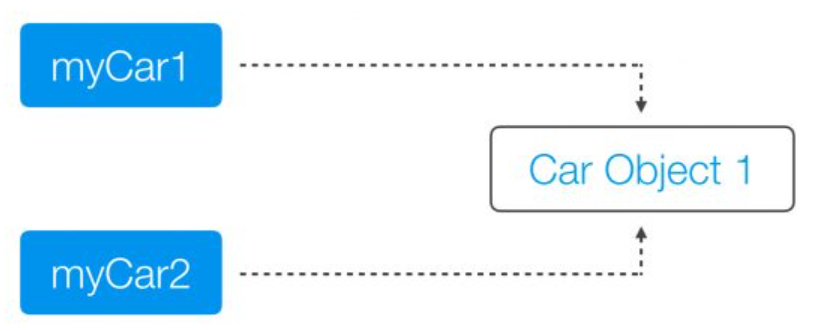
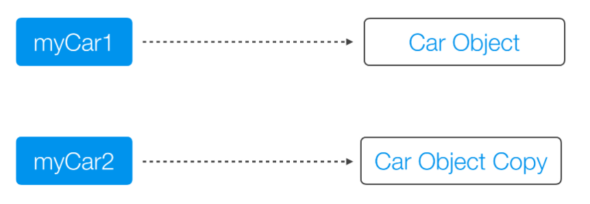

# 拷贝

## 浅拷贝和深拷贝

#### 引用拷贝和对象拷贝

* 引用拷贝

  创建一个指向被拷贝对象的引用，对象仍然只有一个

  

* 对象拷贝

  创建一个对象的拷贝，一共两个对象

  

### 浅拷贝

会对主对象进行拷贝，但不会复制主对象里面的对象

### 深拷贝

## 值传递和引用传递

### 值传递

指调用函数时，**将实际参数复制一份**传递到函数中，对形参的修改**不会影响实际参数**

### 引用传递

在调用函数时，将**实际参数的地址**直接传递到函数中，对形参的修改会直接影响到实际函数

> 其实就和C++中传指针一个意思

### 为什么说Java只有值传递？

Java会将对象地址的拷贝传递给被调函数作为形参

绝对不能认为Java中有引用传递
