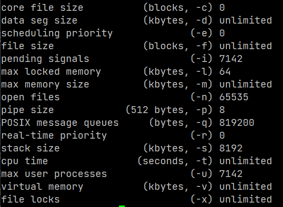
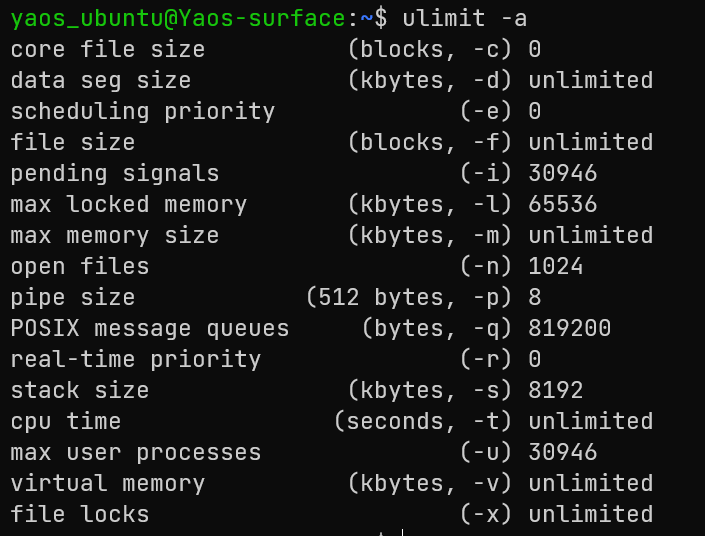
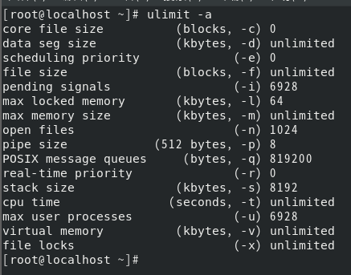

# Linux

---

1. Linux里如何查看一个想知道的进程？

   ```bash
   ps -aux | grep PID
   ```

2. Linux里查看带有关键字的日志文件？

   ```bash
   cat 路径/文件名 | grep 关键字
   ```

   ```bash
   grep -i 关键词 路径/文件名
   ```

3. ***说说你对grep命令的了解？***

   强大的文本搜索命令，全局正则表达式搜索（Global Regular Expression Print）

   工作方式：在一个或多个文件中搜做字符串模板。如果模板包括空格，则必须被引用，模板后的所有字符串被看作文件名。搜索的结果被送到标准输出，不影响源文件内容

## 常用命令

1. `su`

   变更为其他使用者的身份，除 root 外，需要键入该使用者的密码

2. `passwd`

   更改使用者的密码

3. `chmod`

   控制用户对文件权限

   > 权限分为：读、写、执行
   >
   > 文件调用权限分三级：所有者、用户组、其他人

4. `grep`

   文本搜索工具，查找匹配行

5. `find`

   文件搜索工具
   
6. `file`

   辨识文件类型

### 内存相关

- `free`：查看内存使用情况

- `top`：监控系统的运行状态，并可按照CPU、内存、执行时间进行排序

### 解压命令

- `tar -zzzxvf`

- `unzip`

##### 一个进程最多能打开的文件数

- `ulimit -a`

  Linux-2.6：1024

  > 我VPS上是65535，Ubuntu上是1024，本地虚拟机也是1024
  >
  > 
  >
  > 
  >
  > 

## Vim

- `:w`：保存文件，不退出
- `:w file`：将修改另外保存到 file 中，不退出 vim
- `:w!`：强制保存，不退出 vim
- `:wq`：保存文件，退出 vim
- `:wq!`：强制保存文件，退出 vim
- `:q`：不保存文件，退出 vim
- `:q!`：不保存文件，强制退出 vim
- `:e!`：放弃所有修改，从上次保存文件开始再编辑

#### 字符设备&块设备

字符设备只能顺序读取，块设备可以随机存取


* 切换JDK版本：`alternatives --config java`

### 配置环境变量


## 参考

* [Linux命令必知必会](https://developer.aliyun.com/article/69417)

