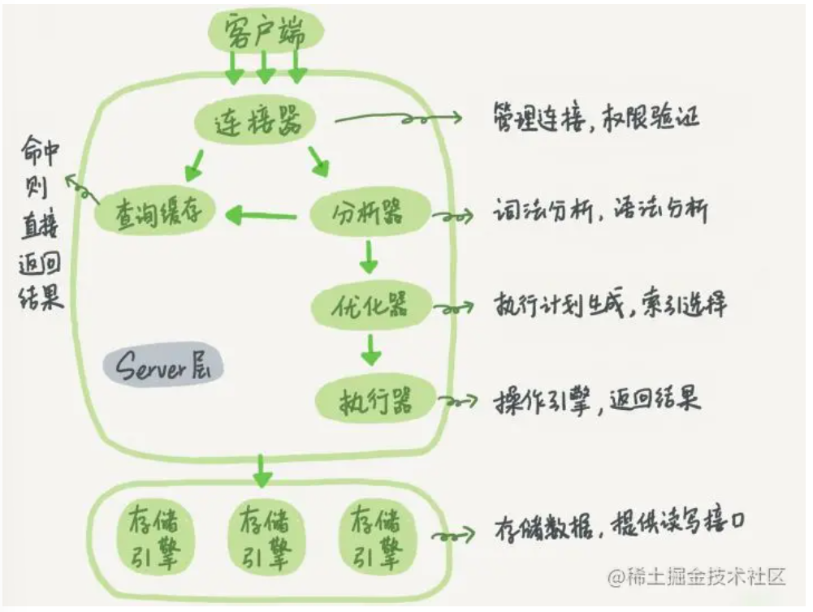

# MySQL

## 概述

### 特点

- **插件式**的存储引擎架构，将查询处理和其他系统任务以及数据的存储、提取相分离

### 架构

1. 连接层

   完成类似于连接处理、授权认证及相关安全方案

2. 服务层

   完成大部分核心服务功能，包括解析、分析、优化、缓存，以及所有的内置函数，所有的跨存储引擎功能也在这里实现，如：触发器、存储过程、视图

3. 引擎层

   真正负责数据的存储和提取

4. 存储层

   将数据存储在运行于该设备的文件系统上，并完成与存储引擎的交互

### 执行

##### 一条SQL语句的执行流程

1. 客户端请求
2. 连接器验证用户身份
3. 查询缓存，存在则直接返回
4. 缓存不存在则分析器对SQL进行词法和语法分析操作
5. 优化器对执行的sql优化，选择最优的执行方案方法
6. 执行器，会先检查权限，有就使用这份引擎提供的接口
7. 去引擎层获取数据返回

## 存储引擎

MySQL中，可以对不同的表使用不同的存储引擎

### 常用的存储引擎

* InnoDB（默认）：支持事务、行级锁定和外键
* MyISAM
* Memory
* NDB

#### MyISAM和InnoDB区别

> MySQL 5.5后默认数据引擎由MyISAM改为InnoDB

1. **InnoDB支持事务，MyISAM不支持**

2. **InnoDB最小锁粒度是行锁，MyISAM最小锁粒度是表锁**

   MyISAM一个更新语句会锁住整张表，因此并发访问受限

3. InnoDB支持外键，MyISAM不支持

4. InnoDB是聚簇索引，MyISAM是非聚簇索引

5. InnoDB不保存表的具体行数，`select count(*) from table`需要检索全表，MyISAM保存

## 分隔

### MVCC

多版本并发控制协议

最大优点是读不加锁，因此读写不冲突，并发性能好

### 主从同步

## 日志

## 参考

* [MySQL 三万字精华总结 + 面试100 问](https://juejin.cn/post/6850037271233331208)
