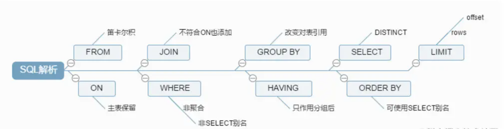

# SQL

## 执行顺序



## 手写SQL

* 并列查询到的结果

  ```sql
  select 男表.dept_name,男,女,男+女 as 总人数 from 
  (select dept_name,COUNT(*)from sys_users,sys_depts where sex=1
  and sys_users.dept_id=sys_depts.dept_id group by dept_id) as 男表,
  (select dept_name,COUNT(*)from sys_users,sys_depts where sex=0
  and sys_users.dept_id=sys_depts.dept_id group by dept_id) as 女表
  where 男表.dept_name=女表.dept_name
  
  
  select 课程名称,COUNT(*)  as 开课数 from 课程表,学生表,成绩表
  where 学生表.学号=成绩表.学号 and 课程表.课程号=成绩表.课程号 group by 课程名称
  UNION
  
  
  select wq.课程名称,男,女,男+女 as 总人数 from 
  (select 课程名称,COUNT(*) as 男 from 学生表,课程表,成绩表 where 性别='男'
  and 学生表.学号=成绩表.学号 and 课程表.课程号=成绩表.课程号 group by 课程名称)as wq,
  (select 课程名称,COUNT(*) as 女 from 学生表,课程表,成绩表 where 性别='女'
  and 学生表.学号=成绩表.学号 and 课程表.课程号=成绩表.课程号 group by 课程名称) as we
  where wq.课程名称=we.课程名称
  ```

  * MySQL不允许对查询到的表直接update

    

## 表关联

### 语法上

1. 内连接
2. 外连接
   * 左外连接
   * 右外连接
3. 等值连接，效果等同于内连接，更建议使用内连接

> MySQL没有完全外连接

### 关系上

1. 一对多：以主表的主键关联从表的外键来实现
2. 多对多：中间表要设计两列，分别存储那两张表的主键
3. 自关联：需要在关联时通过别名将它们当做两张表来看待。一般在表中数据具有层级（树状）时，可以采用自关联一次性查询出多层级的数据

## SQL注入

将SQL代码伪装到输入参数中，传递到服务器解析并执行的一种攻击手法

例如：将`'or 1=1#'`作为用户名

```sql
select * from user where username='' or 1=1 #' and password='123456'
# 会查询出所有的用户登录信息
```

### 如何避免

1. 严格的参数校验

2. SQL预编译

   > 指的是在服务器启动时，MySQL Client把SQL语句的模板（变量采用占位符进行占位）发送给MySQL服务器，MySQL服务器对SQL语句的模板进行编译，编译之后根据语句的优化分析对相应的索引进行优化，在最终绑定参数时把相应的参数传送给MySQL服务器，直接进行执行，节省了SQL查询时间，以及MySQL服务器的资源，达到一次编译、多次执行的目的，除此之外，还可以防止SQL注入。

## 将一张表的数据更新到另一张表

关联更新

```sql
update b set b.col=a.col from a,b where a.id=b.id;
update b set col=a.col from b inner join a on a.id=b.id;
update b set b.col=a.col from b left Join a on b.id = a.id;
```

## WHERE和HAVING区别

WHERE是一个约束声明，使用WHERE约束来自数据库的数据，WHERE是在结果返回之前起作用的，WHERE中不能使用聚合函数

HAVING是一个过滤声明，是在查询返回结果集以后对查询结果进行的过滤操作，HAVING子句中不能使用除了分组字段和聚合函数之外的其他字段。

从性能的角度来说，HAVING子句中如果使用了分组字段作为过滤条件，应该替换成WHERE子句。因为WHERE可以在执行分组操作和计算聚合函数之前过滤掉不需要的数据，性能会更好。