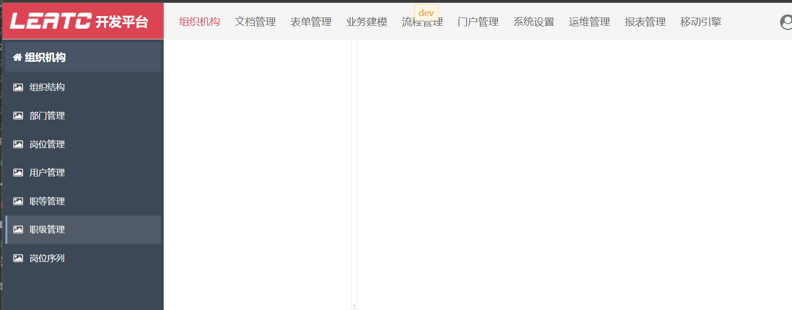
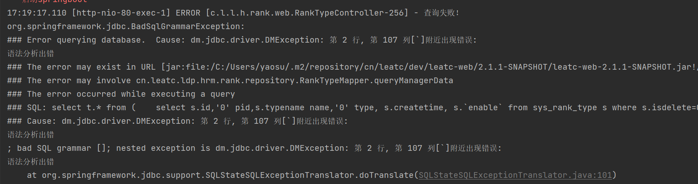
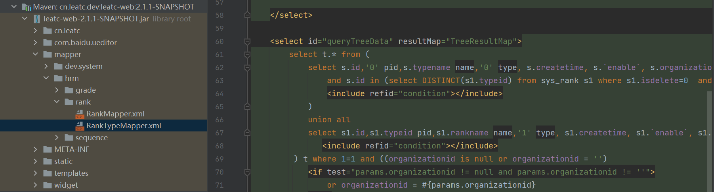
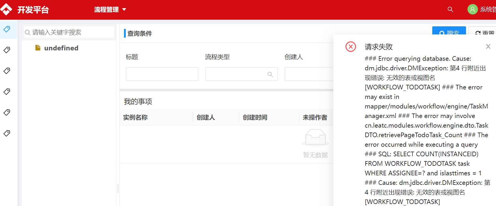
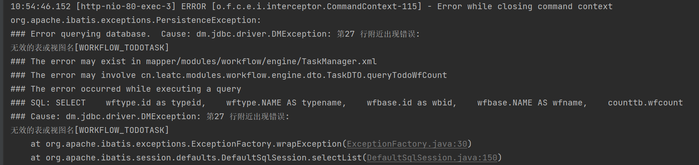
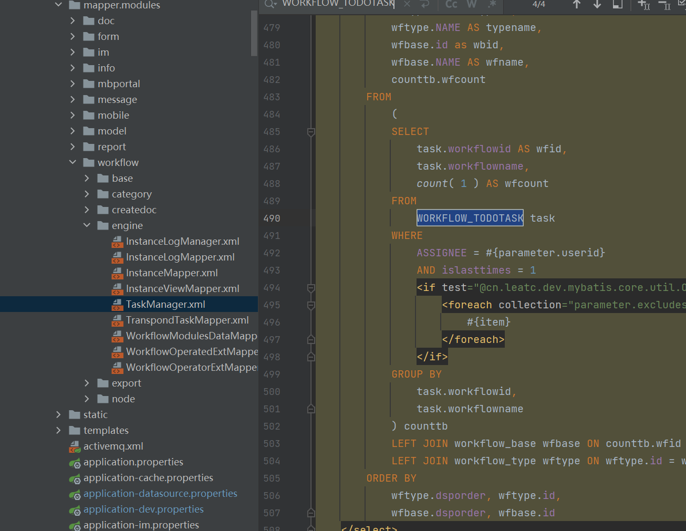
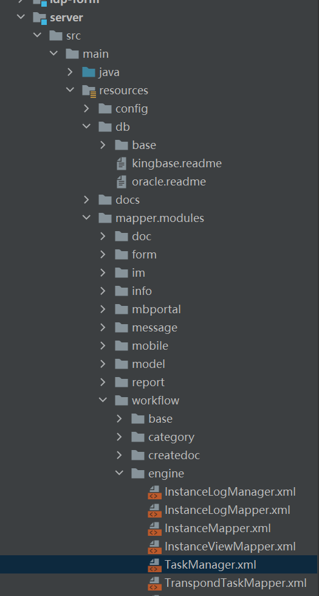

# 国产数据库语句兼容性测试文档

## 银河麒麟-达梦

### 问题1

* 职级管理页无法正常加载





定位



### 问题2

* 流程管理-我的事项









问题出在这里，表名找不到，可能是大小写的问题，先去数据库检查有没有这张表


数据库中是小写表名，那么问题就是表明大小写不一致

==是否大小写敏感是初始化数据库实例时设置的，默认敏感，且一旦设置无法修改==

我记得是设置过大小写不敏感，去检查一下：

打开dmservice.sh

```sql
select case_sensitive();
-- 1大小写敏感，0不敏感
```

查询结果是0

最后问题是视图没有导致的，而不是

对比MySQL和达梦的数据库，发现少了三个视图，于是用SQL语句重建了

重新去检查了流程管理，没有再报错

## 统信-金仓
