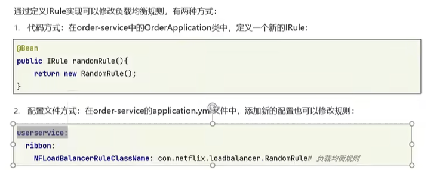

# 微服务


微服务治理

异步通信

缓存

搜索

DevOps


单体架构

微服务是一种经过良好架构设计的**分布式**架构方案，特征：

* 单一职责
* 面向服务：微服务对外暴露业务接口
* 自治：团队独立、技术独立、数据独立、部署独立
* 隔离性强：避免出现级联问题

微服务技术


## 在Java代码中发Http请求

RestTemplate对象

```java
restTemplate.getForObject(url,User.class);
```


## Eureka注册中心

### 作用

在Eureka架构中，微服务角色有两类

1. Eureka-Service：服务端，注册中心
   * 记录服务信息
   * 心跳监控
2. Eureka-Client：客户端
   1. Provider：服务提供者
      * 注册自己的信息到Eureka-Server
      * 每30s向Eureka-Server发送“心跳”
   2. Consumer：服务消费者
      * 根据服务名称从Eureka-Server拉取服务列表
      * 基于服务列表做负载均衡，选中一个微服务后发起远程调用

### 搭建步骤

1. 引入依赖
2. 编写启动项，添加`@EnableEurekaService`注解
3. 编写相关配置

#### 负载均衡

1. 用服务名替代地址中的IP
2. 添加`@LoadBalance`注解

## Nakos注册中心

## Rubbon负载均衡

可以配置负载均衡策略



第一种针对全体，第二种针对某个具体的

## 熔断机制Hystrix

## 路由网关zuul

## 配置中心Spring Cloud config

